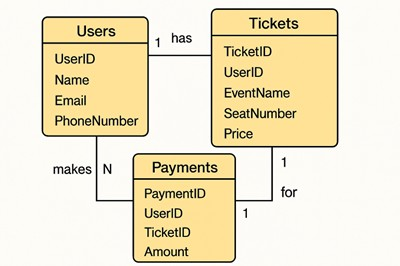

# 🎟️ Online Ticket Booking System Database

## 📌 Project Overview
This is a **DBMS Mini Project**.  
It implements a relational database for an **Online Ticket Booking System** using **MySQL**.

The database manages:
- Users
- Ticket bookings
- Payment details

## 🎯 Objectives
- Create well-structured tables for users, tickets, and payments  
- Perform operations to extract meaningful and structured information  
- Ensure data consistency using relational constraints  

---

## 🛠️ System Design
The system is designed using **Relational Database Management Principles**.  
Key entities:
- **Users** → Stores user details  
- **Tickets** → Stores ticket booking details  
- **Payments** → Stores payment transactions  

Relationships are maintained using **foreign keys** with `ON DELETE CASCADE` and `ON UPDATE CASCADE`.

---

## 🗂️ Database Schema Visualization

The following ER diagram illustrates the relationships between the `Users`, `Tickets`, and `Payments` tables:



- **Users**: Contains user details and serves as a parent to ticket and payment records  
- **Tickets**: Linked to users via `UserID`, includes event and seat details  
- **Payments**: Linked to both users and tickets, records transaction details  

> 📌 Note: The diagram is also included in the project report for reference.

---

## ⚙️ Setup Guide

### 1️⃣ Prerequisites
- Install **MySQL** (version 8.0 or above recommended)  
- Install a SQL client (e.g., MySQL Workbench, DBeaver, or command-line client)  
- Clone the repository:  
  ```bash
  git clone https://github.com/nit-dgp-cse-gp-16/Database-for-Online-Ticket-Booking-System.git
  cd Database-for-Online-Ticket-Booking-System

### 2️⃣ Create Database
- create database TicketBookingDB;
- use TicketBookingDB;

### 3️⃣ Run Table Scripts
- source Users.sql;
- source Tickets.sql;
- source Payments.sql;
